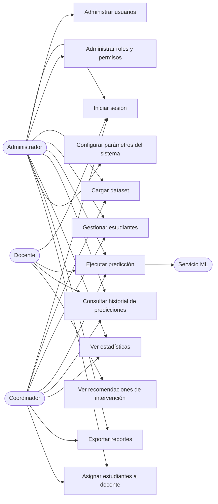

# Casos de Uso

Referencia: [01-requerimientos.md](01-requerimientos.md)

## 1. Actores

| Actor | Descripción |
|-------|-------------|
| **Administrador** | Control total del sistema: usuarios, roles, estudiantes, datasets, predicciones, configuración. |
| **Coordinador** | Gestiona estudiantes y datasets, ejecuta predicciones, consulta/exporta reportes. No administra usuarios. |
| **Docente** | Consulta únicamente a sus estudiantes asignados, ejecuta predicciones sobre ellos y ve recomendaciones. No modifica ni elimina información. |
| **Servicio ML** (actor de apoyo) | Sistema externo (microservicio FastAPI) que recibe datos y responde con una predicción. No es un usuario humano, pero participa como actor secundario en varios casos de uso. |

## 2. Diagrama general de casos de uso

## 3. Casos de uso detallados

### UC-01 Iniciar sesión
- **Actor:** Administrador, Coordinador, Docente
- **Precondición:** El usuario tiene una cuenta activa.
- **Flujo principal:**
  1. El usuario ingresa correo/usuario y contraseña.
  2. El sistema valida credenciales.
  3. El sistema emite un token de sesión y redirige al dashboard correspondiente a su rol.
- **Flujos alternativos:** credenciales inválidas → mensaje de error y registro del intento fallido (RF-05). Cuenta desactivada → acceso denegado.
- **Poscondición:** Sesión activa asociada al rol y permisos del usuario.

### UC-02 Administrar usuarios
- **Actor:** Administrador
- **Precondición:** Sesión activa con permiso `users:manage`.
- **Flujo principal:**
  1. El Administrador accede al módulo de usuarios.
  2. Crea, edita, desactiva o elimina un usuario.
  3. Asigna uno o más roles al usuario.
  4. El sistema persiste los cambios y los refleja de inmediato en los permisos efectivos del usuario.
- **Poscondición:** Usuario creado/actualizado con su(s) rol(es) vigente(s).

### UC-03 Administrar roles y permisos
- **Actor:** Administrador
- **Flujo principal:**
  1. El Administrador crea o edita un rol.
  2. Selecciona los permisos que ese rol otorga, de un catálogo de permisos del sistema.
  3. El sistema guarda la configuración; los usuarios con ese rol quedan afectados sin necesidad de redepliegue.
- **Nota de diseño:** este caso de uso es la base de RNF-02 (flexibilidad de permisos).

### UC-04 Cargar dataset de estudiantes
- **Actor:** Administrador, Coordinador
- **Precondición:** Existe un catálogo de columnas configurado (o se usa el catálogo por defecto).
- **Flujo principal:**
  1. El usuario sube un archivo CSV/Excel.
  2. El sistema valida cada columna/fila contra el catálogo activo de columnas.
  3. Si es válido, el sistema crea/actualiza los registros de estudiantes correspondientes.
  4. El sistema registra la carga en el historial (RF-19).
- **Flujo alternativo:** errores de validación → el sistema muestra un reporte de errores por fila/columna sin aplicar cambios parciales (carga atómica) o permite revisión antes de confirmar.
- **Poscondición:** Estudiantes/registros actualizados; carga registrada en historial.

### UC-05 Gestionar estudiantes
- **Actor:** Administrador, Coordinador
- **Flujo principal:**
  1. El usuario busca/filtra estudiantes.
  2. Da de alta, edita o consulta el detalle de un estudiante (incluyendo campos dinámicos del dataset).
- **Restricción:** el Docente no tiene acceso a este caso de uso (solo lectura vía UC-06/UC-09 sobre sus asignados).

### UC-06 Ejecutar predicción
- **Actor:** Administrador, Coordinador, Docente
- **Precondición:** El estudiante cuenta con datos suficientes para el modelo.
- **Flujo principal:**
  1. El usuario selecciona un estudiante (o un grupo, si su rol lo permite) y solicita una predicción.
  2. El backend envía los datos relevantes al Servicio ML.
  3. El Servicio ML responde con clasificación de riesgo, score y variables relevantes.
  4. El sistema guarda el resultado en el historial y lo muestra al usuario junto con recomendaciones (UC-09).
- **Restricción de alcance:** un Docente solo puede ejecutar predicciones sobre estudiantes que tiene asignados (RF-14).
- **Flujo alternativo:** el Servicio ML no responde/error → el sistema informa el fallo y no genera un registro de resultado exitoso.

### UC-07 Consultar historial de predicciones
- **Actor:** Administrador, Coordinador, Docente
- **Flujo principal:** el usuario filtra por estudiante, fecha, carrera o grupo y visualiza las predicciones pasadas con su resultado y modelo/versión usada.
- **Restricción:** el Docente solo ve historial de sus estudiantes asignados.

### UC-08 Ver estadísticas
- **Actor:** Administrador, Coordinador
- **Flujo principal:** el usuario visualiza dashboards agregados (porcentaje en riesgo por carrera/semestre, tendencias en el tiempo, distribución de resultados).

### UC-09 Ver recomendaciones de intervención
- **Actor:** Docente (también visible para Admin/Coordinador como parte de UC-06)
- **Flujo principal:** tras una predicción, el sistema muestra sugerencias de intervención asociadas al nivel de riesgo detectado (p. ej. tutoría, canalización a psicopedagogía, seguimiento de asistencia).

### UC-10 Exportar reportes
- **Actor:** Administrador, Coordinador
- **Flujo principal:** el usuario define filtros (carrera, periodo, nivel de riesgo) y exporta el resultado en CSV/PDF.

### UC-11 Configurar parámetros del sistema
- **Actor:** Administrador
- **Flujo principal:** el Administrador edita catálogo de columnas del dataset, catálogo de carreras, umbrales de riesgo y otros parámetros generales, sin intervención de un desarrollador.

### UC-12 Asignar estudiantes a docente
- **Actor:** Administrador, Coordinador
- **Flujo principal:** el usuario selecciona uno o varios estudiantes y los asocia a un Docente (relación muchos a muchos: un docente puede tener varios estudiantes y un estudiante puede tener varios docentes, p. ej. por materia).

## 4. Matriz resumen de permisos por caso de uso

| Caso de uso | Administrador | Coordinador | Docente |
|---|:---:|:---:|:---:|
| UC-01 Iniciar sesión | ✔ | ✔ | ✔ |
| UC-02 Administrar usuarios | ✔ | ✘ | ✘ |
| UC-03 Administrar roles y permisos | ✔ | ✘ | ✘ |
| UC-04 Cargar dataset | ✔ | ✔ | ✘ |
| UC-05 Gestionar estudiantes | ✔ | ✔ | ✘ (solo lectura de asignados) |
| UC-06 Ejecutar predicción | ✔ (todos) | ✔ (todos) | ✔ (solo asignados) |
| UC-07 Consultar historial | ✔ (todos) | ✔ (todos) | ✔ (solo asignados) |
| UC-08 Ver estadísticas | ✔ | ✔ | ✘ |
| UC-09 Ver recomendaciones | ✔ | ✔ | ✔ (solo asignados) |
| UC-10 Exportar reportes | ✔ | ✔ | ✘ |
| UC-11 Configurar parámetros | ✔ | ✘ | ✘ |
| UC-12 Asignar estudiantes a docente | ✔ | ✔ | ✘ |

> Esta matriz es el punto de partida para el catálogo de permisos (RF-09) pero se implementa como datos configurables, no como lógica fija en código (ver [03-arquitectura.md](03-arquitectura.md), sección RBAC).
