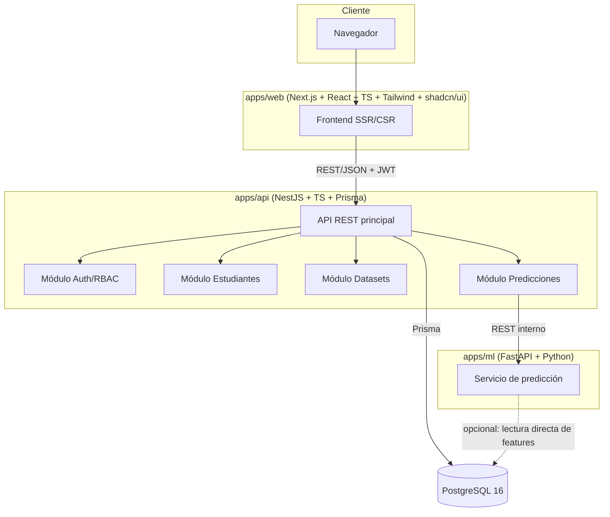
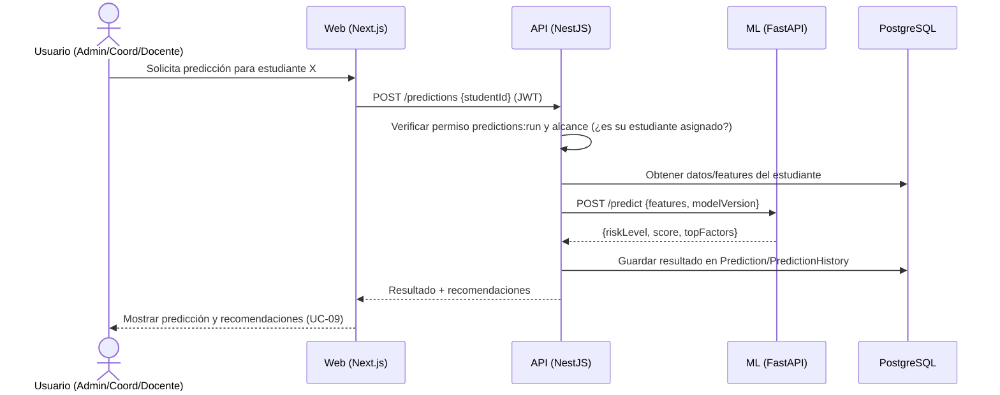

# Arquitectura del Sistema

Referencia: [01-requerimientos.md](01-requerimientos.md), [02-casos-uso.md](02-casos-uso.md)

## 1. Vista general

Arquitectura de microservicios ligera, tres aplicaciones independientes orquestadas con Docker Compose, comunicadas por HTTP/REST:



**Principio clave:** el frontend nunca habla directamente con el servicio de ML ni con la base de datos. Todo pasa por la API de NestJS, que centraliza autenticación, autorización y reglas de negocio. Esto mantiene bajo acoplamiento y permite reemplazar/versionar el servicio ML sin tocar el frontend.

## 2. Justificación del stack

| Capa | Tecnología | Motivo |
|---|---|---|
| Frontend | Next.js + React + TypeScript + Tailwind + shadcn/ui | SSR/SSG para carga rápida de dashboards, tipado end-to-end, componentes accesibles ya construidos (shadcn) que aceleran el desarrollo. |
| Backend | NestJS + TypeScript + Prisma | Arquitectura modular (módulos/controladores/servicios) alineada con RBAC y separación por dominio; Prisma da migraciones tipadas y seguras contra inyección SQL. |
| ML | FastAPI + Python | Ecosistema estándar de ML en Python (scikit-learn/pandas/etc.), independiente del ciclo de vida del backend Node. |
| BD | PostgreSQL 16 | Soporta JSONB (clave para el esquema flexible de estudiantes), robusto para relaciones (usuarios/roles/permisos). |
| Contenedores | Docker + Docker Compose | Mismo entorno en desarrollo y producción; portabilidad a cualquier VPS/cloud. |
| Paquetes | pnpm | Monorepo eficiente en disco y instalación para los proyectos Node (web + api). |

## 3. Principios de diseño

1. **Bajo acoplamiento entre capas.** Web ⇄ API ⇄ ML son servicios independientes con contratos HTTP definidos (OpenAPI/Swagger en NestJS y FastAPI). Cada uno puede desplegarse y escalar por separado.
2. **Esquema de estudiantes extensible sin tocar código.** Ver sección 4 y detalle completo en [04-diseno-base-datos.md](04-diseno-base-datos.md).
3. **RBAC dirigido por datos, no por código.** Roles y permisos viven en tablas (`Role`, `Permission`, `RolePermission`), no como `enum` fijo en el backend. Agregar un permiso nuevo es una operación de datos + un `guard` genérico que verifica claves de permiso (string), no un cambio de lógica por rol.
4. **ML como frontera reemplazable.** El contrato entre `api` y `ml` es un endpoint `POST /predict` con un payload versionado. Cambiar de modelo, reentrenar o incluso reescribir el servicio ML en otro framework no debería requerir cambios en `api` más allá de, en el peor caso, el payload versionado.
5. **12-factor / cloud-ready desde el día uno.** Configuración por variables de entorno, sin estado en disco local de las apps (los uploads de datasets se procesan y persisten en BD, no en filesystem del contenedor), logs a stdout. Esto permite mover de Docker Compose local a AWS/Azure/DigitalOcean (ECS, App Service, Droplets+Compose, etc.) sin rediseño.

## 4. Estrategia de extensibilidad del dataset

Problema: el dataset definitivo del ITM aún no existe; las columnas pueden cambiar (agregarse/eliminarse) durante o después del desarrollo.

Solución (detallada en el documento de BD): modelo híbrido **catálogo de columnas + JSONB**.

- Una tabla `dataset_column_definition` describe qué columnas existen, su tipo y si son requeridas. Esto es configurable desde UI (UC-11), sin migraciones de BD.
- Los valores específicos de cada estudiante para esas columnas se guardan en un campo `JSONB` (`Student.extra_data`), mientras que un pequeño núcleo de columnas realmente estructurales (identificador, nombre, carrera, estatus) permanece como columnas relacionales normales para poder indexarlas y hacer joins eficientes.
- Agregar una columna nueva = insertar una fila en `dataset_column_definition` + que las próximas cargas la incluyan en el JSONB. No implica ALTER TABLE ni redeploy.
- Quitar una columna = desactivarla en el catálogo (soft delete), sin perder datos históricos ya almacenados en el JSONB.

Esto evita dos extremos problemáticos: (a) una tabla EAV pura (demasiado lenta/compleja para reportes) y (b) columnas SQL fijas por cada campo del dataset (obliga a migraciones cada vez que cambia el dataset institucional).

## 5. Estrategia de extensibilidad de roles y permisos

- `Role` (id, nombre, descripción) — ej. Administrador, Coordinador, Docente, y cualquier rol futuro.
- `Permission` (id, clave única, descripción) — ej. `users:manage`, `students:write`, `predictions:run`, `reports:export`.
- `RolePermission` (role_id, permission_id) — matriz configurable equivalente a la tabla de la sección 4 de [02-casos-uso.md](02-casos-uso.md).
- `User` tiene una relación con `Role` (N:1 en la versión inicial, ver nota de diseño en requerimientos; el modelo de datos soporta N:N a futuro).
- En NestJS, un `PermissionsGuard` genérico lee las claves de permiso requeridas por un endpoint (decorador `@RequirePermission('students:write')`) y las compara contra los permisos efectivos del usuario autenticado, resueltos desde BD/cache. Ningún guard queda hardcodeado a "si es Coordinador entonces...".

## 6. Comunicación entre servicios

| Origen → Destino | Protocolo | Autenticación |
|---|---|---|
| Browser → Web (Next.js) | HTTPS | Cookie/sesión de Next.js |
| Web → API (NestJS) | REST/JSON sobre HTTPS | JWT (Bearer) |
| API → ML (FastAPI) | REST/JSON interno (red Docker, no expuesto a internet) | API key interna / red privada del compose |
| API → PostgreSQL | Prisma (TCP) | Credenciales por variable de entorno |

## 7. Seguridad

- Contraseñas con `argon2` o `bcrypt`.
- JWT de acceso de corta duración + refresh token; invalidación en logout (UC-01/RF-04).
- Validación de entrada con `class-validator`/`zod` en NestJS y `pydantic` en FastAPI.
- Prisma como capa de acceso a datos parametrizada (mitiga inyección SQL).
- CORS restringido a los orígenes del frontend.
- Rate limiting en endpoints de autenticación.
- Auditoría (`AuditLog`) para acciones sensibles: login fallido, cambios de usuarios/roles, cargas de dataset, ejecución de predicciones (RNF-09).
- El servicio ML no se expone públicamente; solo es alcanzable desde la red interna de Docker/API.

## 8. Despliegue

### 8.1 Desarrollo local (Docker Compose)

Servicios propuestos en `docker-compose.yml`:
- `db` (postgres:16)
- `api` (NestJS, puerto interno 3000/4000)
- `web` (Next.js, puerto 3001)
- `ml` (FastAPI, puerto interno 8000)
- (opcional a futuro) `nginx`/reverse proxy si se requiere un solo punto de entrada

Variables sensibles vía `.env` (no versionado), con `.env.example` documentado.

### 8.2 Producción / cloud

Sin cambios de arquitectura: los mismos contenedores se despliegan en un Droplet/VM con Docker Compose, o se migran a servicios administrados (ECS/App Runner, Azure Container Apps, App Platform de DigitalOcean) manteniendo el mismo contrato de imágenes y variables de entorno. La base de datos puede migrarse a un servicio gestionado (RDS, Azure Database for PostgreSQL, Managed Databases de DigitalOcean) cambiando solo `DATABASE_URL`.

## 9. Estructura de monorepo propuesta (referencia, aún no creada)

```
Sistema_Web_Prediccion/
├── apps/
│   ├── web/          # Next.js
│   ├── api/          # NestJS + Prisma
│   └── ml/            # FastAPI
├── packages/
│   └── shared-types/  # Tipos/DTOs compartidos entre web y api (opcional)
├── docs/               # Este conjunto de documentos
├── docker-compose.yml
├── docker-compose.override.yml (dev)
└── pnpm-workspace.yaml
```

## 10. Diagrama de secuencia: ejecutar predicción (UC-06)


