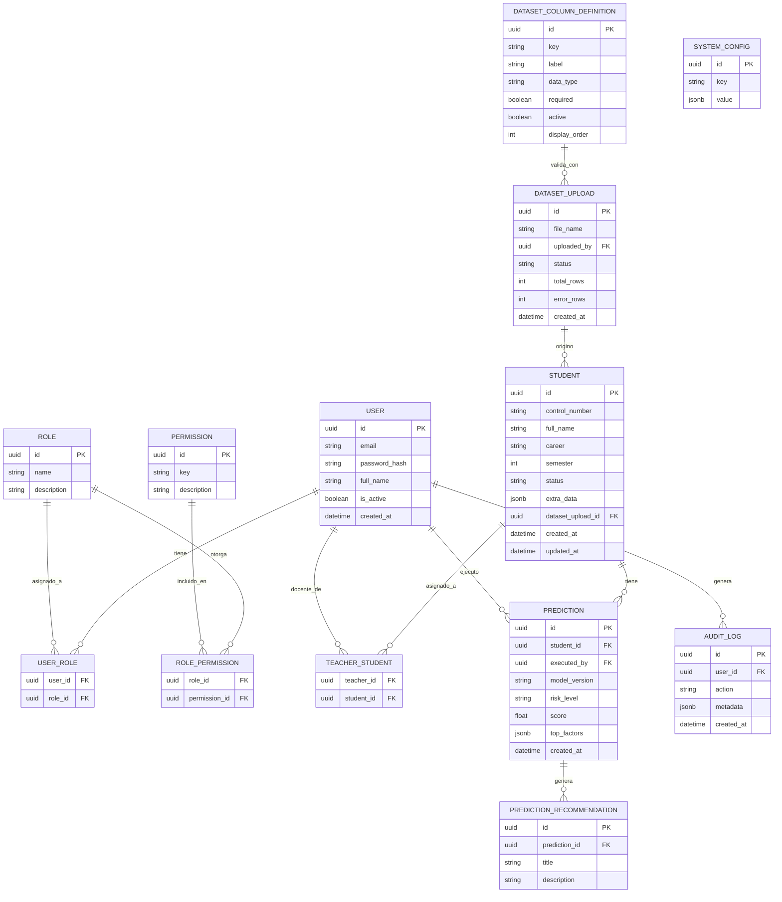

# Diseño de Base de Datos

Motor: **PostgreSQL 16**. ORM: **Prisma**.
Referencia: [03-arquitectura.md](03-arquitectura.md) sección 4-5.

## 1. Decisión de diseño: esquema flexible de estudiantes

Dos opciones evaluadas para soportar columnas variables del dataset (RNF-01):

| Opción | Descripción | Pros | Contras |
|---|---|---|---|
| A. EAV puro | Una fila por cada (estudiante, columna, valor) | Máxima flexibilidad | Consultas/reportes lentos y complejos; difícil de tipar |
| **B. Catálogo + JSONB (elegida)** | Columnas núcleo fijas + `JSONB` para el resto, validado contra un catálogo configurable | Buen balance flexibilidad/rendimiento; PostgreSQL indexa y consulta JSONB de forma nativa (`GIN`) | Requiere disciplina de validación en la capa de aplicación |

Se elige **Opción B**: columnas verdaderamente estructurales (identificador, nombre, carrera, semestre, estatus, timestamps) quedan como columnas SQL normales para poder indexar, filtrar y hacer join eficientemente (UC-05, UC-08). El resto de atributos académicos (promedios, materias, créditos, adeudos, y cualquier columna futura del ITM) vive en `extra_data JSONB`, cuya forma está descrita por `dataset_column_definition`.

## 2. Diagrama entidad-relación



## 3. Descripción de entidades

- **User**: cuentas del sistema (Administrador, Coordinador, Docente y futuros roles).
- **Role / Permission / RolePermission**: RBAC dirigido por datos (ver arquitectura §5). El catálogo inicial de permisos se deriva de la matriz de [02-casos-uso.md](02-casos-uso.md) §4, pero es editable.
- **UserRole**: modelado N:N desde el inicio aunque la UI inicial solo asigne un rol por usuario; evita una migración futura si se decide permitir múltiples roles.
- **Student**: núcleo estructural + `extra_data JSONB` para las columnas variables del dataset.
- **TeacherStudent**: relación N:N que resuelve "estudiantes asignados" (RF-13/RF-14).
- **DatasetColumnDefinition**: catálogo configurable de columnas esperadas del dataset (RF-18); `active=false` implementa el "quitar columna sin perder histórico".
- **DatasetUpload**: bitácora de cargas de archivos (RF-19/RF-20), referenciada por los `Student` que se crearon/actualizaron en esa carga.
- **Prediction**: un resultado de ejecución de predicción, ligado a la versión de modelo usada (permite comparar resultados entre versiones de modelo con el tiempo).
- **PredictionRecommendation**: recomendaciones de intervención asociadas a una predicción (UC-09), independientes para poder tener 0..N por predicción.
- **AuditLog**: bitácora genérica de acciones sensibles (RNF-09).
- **SystemConfig**: parámetros generales configurables (umbral de riesgo, catálogo de carreras, etc. — UC-11), como pares clave/valor JSONB para evitar migraciones por cada parámetro nuevo.

## 4. Esquema Prisma de referencia (borrador, no definitivo)

```prisma
model User {
  id           String   @id @default(uuid())
  email        String   @unique
  passwordHash String
  fullName     String
  isActive     Boolean  @default(true)
  createdAt    DateTime @default(now())

  roles         UserRole[]
  teacherOf     TeacherStudent[]
  predictions   Prediction[]
  datasetUploads DatasetUpload[]
  auditLogs     AuditLog[]
}

model Role {
  id          String @id @default(uuid())
  name        String @unique
  description String?

  users       UserRole[]
  permissions RolePermission[]
}

model Permission {
  id          String @id @default(uuid())
  key         String @unique
  description String?

  roles RolePermission[]
}

model UserRole {
  userId String
  roleId String
  user   User @relation(fields: [userId], references: [id])
  role   Role @relation(fields: [roleId], references: [id])

  @@id([userId, roleId])
}

model RolePermission {
  roleId       String
  permissionId String
  role         Role       @relation(fields: [roleId], references: [id])
  permission   Permission @relation(fields: [permissionId], references: [id])

  @@id([roleId, permissionId])
}

model Student {
  id              String   @id @default(uuid())
  controlNumber   String   @unique
  fullName        String
  career          String
  semester        Int
  status          String   @default("active")
  extraData       Json     @default("{}")
  datasetUploadId String?
  datasetUpload   DatasetUpload? @relation(fields: [datasetUploadId], references: [id])
  createdAt       DateTime @default(now())
  updatedAt       DateTime @updatedAt

  teachers    TeacherStudent[]
  predictions Prediction[]

  @@index([career, semester])
}

model TeacherStudent {
  teacherId String
  studentId String
  teacher   User    @relation(fields: [teacherId], references: [id])
  student   Student @relation(fields: [studentId], references: [id])

  @@id([teacherId, studentId])
}

model DatasetColumnDefinition {
  id           String  @id @default(uuid())
  key          String  @unique
  label        String
  dataType     String  // "string" | "number" | "boolean" | "date"
  required     Boolean @default(false)
  active       Boolean @default(true)
  displayOrder Int     @default(0)
}

model DatasetUpload {
  id         String   @id @default(uuid())
  fileName   String
  uploadedBy String
  uploader   User     @relation(fields: [uploadedBy], references: [id])
  status     String   // "processing" | "completed" | "failed"
  totalRows  Int      @default(0)
  errorRows  Int      @default(0)
  createdAt  DateTime @default(now())

  students Student[]
}

model Prediction {
  id           String   @id @default(uuid())
  studentId    String
  student      Student  @relation(fields: [studentId], references: [id])
  executedBy   String
  executor     User     @relation(fields: [executedBy], references: [id])
  modelVersion String
  riskLevel    String   // "low" | "medium" | "high"
  score        Float
  topFactors   Json     @default("[]")
  createdAt    DateTime @default(now())

  recommendations PredictionRecommendation[]

  @@index([studentId, createdAt])
}

model PredictionRecommendation {
  id           String     @id @default(uuid())
  predictionId String
  prediction   Prediction @relation(fields: [predictionId], references: [id])
  title        String
  description  String
}

model AuditLog {
  id        String   @id @default(uuid())
  userId    String
  user      User     @relation(fields: [userId], references: [id])
  action    String
  metadata  Json     @default("{}")
  createdAt DateTime @default(now())
}

model SystemConfig {
  id    String @id @default(uuid())
  key   String @unique
  value Json
}
```

## 5. Índices y rendimiento

- Índice único en `Student.controlNumber` (búsquedas y validación de duplicados en cargas).
- Índice compuesto `(career, semester)` en `Student` para filtros frecuentes (UC-05/UC-08).
- Índice `GIN` sobre `Student.extraData` si se requiere filtrar/buscar por campos dinámicos con frecuencia: `CREATE INDEX ON "Student" USING GIN ("extraData");` (se agrega vía migración cuando el patrón de consulta lo justifique).
- Índice compuesto `(studentId, createdAt)` en `Prediction` para historial (UC-07).

## 6. Estrategia de migraciones

- Prisma Migrate para todo cambio de columnas núcleo (poco frecuente).
- Cambios en la estructura del dataset del ITM **no** generan migraciones: se resuelven insertando/desactivando filas en `DatasetColumnDefinition`.
- Semillas (`seed.ts`) para roles, permisos y su matriz inicial (tomada de [02-casos-uso.md](02-casos-uso.md) §4), y para el catálogo de columnas por defecto listado en el brief del proyecto.
